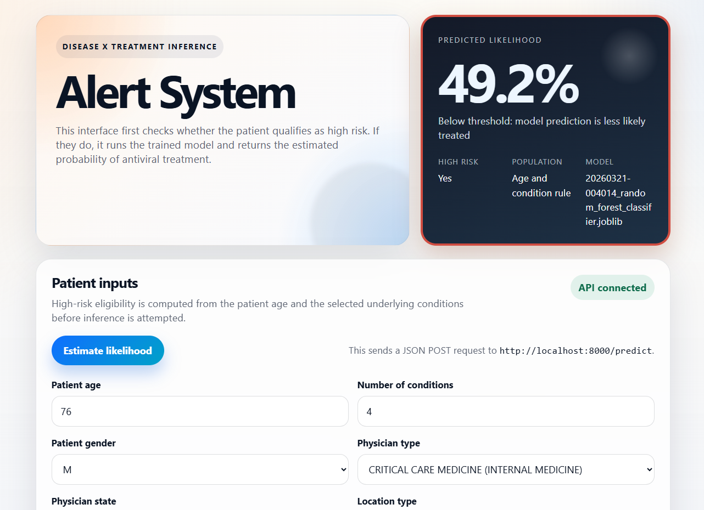

# ml-antiviral-diagnosis
## by Stavros Tseranidis
### A case study for an alert system for antiviral treatment

## Repository Structure

- `dataset/`: Input datasets, intermediate CSV outputs, and the original case-study sheets.
- `docker/`: Dockerfiles used to build the API and UI containers.
- `images/`: Saved images for model performance plots and UI screenshots.
- `ml_antiviral_diagnosis/`: Core Python package containing data engineering, feature engineering, and API code.
- `models/`: Persisted trained model artifacts used for inference.
- `notebooks/`: Exploratory and modeling notebooks for data preparation, feature engineering, and training.
- `tests/`: Unit tests for the core module logic and API behavior.
- `ui/`: React + Vite frontend for test and explore the API. Enter patient data and display inference results.

## Software Architecture And Design Choices

- `ml_antiviral_diagnosis/feature_engineering.py` contains reusable feature-engineering and high-risk eligibility logic so the same rules can be shared across notebooks, tests, and the API.
- `ml_antiviral_diagnosis/api.py` exposes a small FastAPI inference service with Pydantic request/response models, categorical-option discovery, validation, and model loading separated from the HTTP layer.
- `ui/` contains a lightweight React + Vite frontend that calls the API, renders the required inputs, and displays eligibility plus inference results in a simple single-page workflow.
- `tests/` covers the core transformation and inference behavior so the feature pipeline and API contract can be changed with less risk.
- The application is containerized with Docker Compose so the API and UI can be started together locally with a consistent runtime.

## Model Table Output

- Final feature-engineered model table CSV: `dataset/model_table_feature_engineered.csv`
- Original model table layout provided with the exercise: `dataset/original_sheets/model_table.csv`

## Local development

This project uses `uv` with `pyproject.toml` for dependency management.

### 1) Install uv globally

- Windows (Git Bash): `py -m pip install uv`
- macOS: `python3 -m pip install uv`

### 2) Create and activate virtual environment


- Windows (Git Bash):
	- `uv venv .venv`
	- `source .venv/Scripts/activate`
- macOS (zsh/bash):
	- `uv venv .venv`
	- `source .venv/bin/activate`

### 3) Install dependencies

- Main deps only: `uv sync`
- Include dev deps (notebooks + linting): `uv sync --extra dev`

### 4) Use the environment in notebooks (VS Code)

1. First set the Python interpreter to `.venv`:
	- Open Command Palette (`Ctrl+Shift+P`, or `Ctrl+P` then type `>`).
	- Run `Python: Select Interpreter`.
	- Choose the `.venv` interpreter from this project.
2. Open a notebook in `notebooks/`.
3. Select kernel from top-right and choose the `.venv` / project interpreter.

### Linting and notebooks

- For `.py` files (with auto formatting):
    - `uv run ruff check . --fix`
    - `uv run black .`
- For `.ipynb`, run through `nbqa`:
	- `uv run nbqa ruff notebooks/`
	- `uv run nbqa black notebooks/`

## Run With Docker Compose

From the project root, start the API and the UI:

```bash
cd /path/to/ml-antiviral-diagnosis
docker compose up --build
```

To stop the running containers, press `Ctrl+C` in the terminal where Compose is running.

If you want to stop and remove the containers before starting again:

```bash
docker compose down
docker compose up --build
```

After startup:

- UI: `http://localhost:3000`
- API health check: `http://localhost:8000/health`
- API docs: `http://localhost:8000/docs`

### UI Screenshot



## Query The API

Get the allowed dropdown values for the categorical fields:

```bash
curl http://localhost:8000/categorical-options
```

Run a prediction with a JSON request body:

```bash
curl -X POST http://localhost:8000/predict \
	-H "Content-Type: application/json" \
	-d '{
		"PATIENT_AGE": 71,
		"PATIENT_GENDER": "M",
		"NUM_CONDITIONS": 0,
		"PHYSICIAN_TYPE": "UNSPECIFIED",
		"PHYSICIAN_STATE": "UNSPECIFIED",
		"LOCATION_TYPE": "INDEPENDENT LABORATORY",
		"INSURANCE_TYPE": "COMMERCIAL",
		"CONTRAINDICATIONS": "Unspecified",
		"UNDERLYING_CONDITIONS": ["DIABETES"]
	}'
```

Example response for a high-risk patient:

```json
{
	"high_risk": true,
	"message": "Patient is high risk. Inference completed successfully.",
	"prediction": 1,
	"predicted_probability": 0.75,
	"threshold": 0.5,
	"model_filename": "20260321-004014_random_forest_classifier.joblib"
}
```

Example response for a patient who is not high risk:

```json
{
	"high_risk": false,
	"message": "Patient does not meet the high-risk criteria, so inference was not run.",
	"prediction": null,
	"predicted_probability": null,
	"threshold": null,
	"model_filename": null
}
```